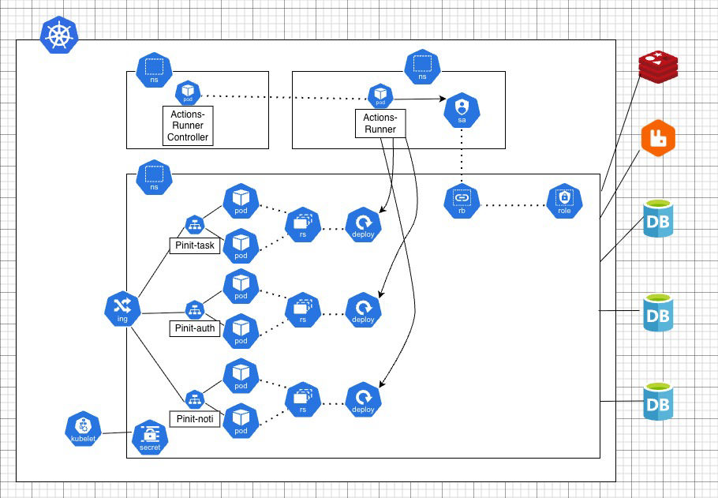

# 당신의 꿈을 현실로, "[Pinit](https://pinit.go-gradually.me)"!

## 프로젝트 소개

최근 AI의 발전으로, 접해보지 못한 새로운 영역에 대한 진입장벽이 낮아짐을 깨달았습니다.

하지만 막상 무언가를 시작하려고 해도, 
- 자신이 무엇을 모르는지 몰라 시작하기도 어려워하거나 
- 제대로 수행했는지 몰라 성취감을 느끼기 어려워하는 

친구들을 발견했습니다.

저희 서비스는 자신의 성취에 대한 피드백 루프+큰 문제를 쪼개주기 위한 도구의 필요성을 느끼게 되면서 시작되었습니다.

Pinit은 이 문제의 해결에 사명감을 갖고 해결하고자 합니다.

## 배포 링크

- [Pinit 배포 링크](https://pinit.go-gradually.me)
- [Pinit-task API 문서](https://api.pinit.go-gradually.me/swagger-ui/index.html)
- [Pinit-auth API 문서](https://auth.pinit.go-gradually.me/swagger-ui/index.html)
- [Pinit-notification API 문서](https://notification.pinit.go-gradually.me/swagger-ui/index.html)

## 백엔드 아키텍처

## 존재하는 프로젝트
- [Pinit-task](https://github.com/Pinit-Scheduler/pinit-task)
- [Pinit-auth](https://github.com/Pinit-Scheduler/pinit-auth)
- [Pinit-notification](https://github.com/Pinit-Scheduler/pinit-notification)
- Pinit-AI (비공개, 일정 쪼개기 기능 개발 중)
- Pinit-RL (비공개, 일정 시간대 배치 강화학습 알고리즘 개발 중)
- [Pinit-frontend]()
