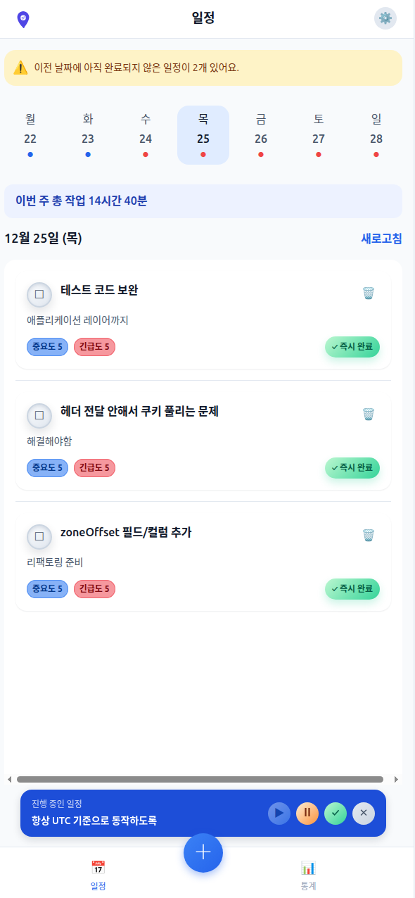

# 당신의 꿈을 현실로, "[Pinit](https://pinit.go-gradually.me)"!

## 프로젝트 소개

최근 AI의 발전으로, 접해보지 못한 새로운 영역에 대한 진입장벽이 낮아짐을 깨달았습니다.

하지만 막상 무언가를 시작하려고 해도, 
- 자신이 무엇을 모르는지 몰라 시작하기도 어려워하거나 
- 제대로 수행했는지 몰라 성취감을 느끼기 어려워하는 

친구들을 발견했습니다.

저희 서비스는 자신의 성취에 대한 피드백 루프+큰 문제를 쪼개주기 위한 도구의 필요성을 느끼게 되면서 시작되었습니다.

Pinit은 이 문제의 해결에 사명감을 갖고 해결하고자 합니다.

> 핀잇은 당신의 시작과 끝에서 함께합니다.

## 배포 링크

- [Pinit 배포 링크](https://pinit.go-gradually.me)
- [Pinit-task API 문서](https://api.pinit.go-gradually.me/swagger-ui/index.html)
- [Pinit-auth API 문서](https://auth.pinit.go-gradually.me/swagger-ui/index.html)
- [Pinit-notification API 문서](https://notification.pinit.go-gradually.me/swagger-ui/index.html)

## 백엔드 아키텍처

## 존재하는 프로젝트
- [Pinit-task](https://github.com/Pinit-Scheduler/pinit-task)
- [Pinit-auth](https://github.com/Pinit-Scheduler/pinit-auth)
- [Pinit-notification](https://github.com/Pinit-Scheduler/pinit-notification)
- Pinit-AI (비공개, 일정 쪼개기 기능 개발 중)
- Pinit-RL (비공개, 일정 시간대 배치 강화학습 알고리즘 개발 중)
- [Pinit-frontend]()

---
## 기술적 결정

### 마이크로서비스 아키텍처

- 일정 관리 시스템과 인증 시스템, 알림 시스템 간의 **바운디드 컨텍스트가 다르다**고 판단하여, **MSA**를 도입하는 결정을 수행하였습니다.
    
- github actions에서 지원하는 **self-hosted runner**를 이용해, 로컬 환경에서의 보안적으로 안전한 CI/CD를 구축하였습니다.
    
- **무중단 배포 및 운영**을 위해, k8s의 경량화판인 **k3s**를 도입하여, **서비스 디스커버리** 및 **롤링 배포**를 도입하였습니다.
    

---

### 일정 관리 서비스

- 일정의 미시작/일시정지/진행중/완료 상태 관리
    
    - 사용자는 뮤직 플레이어처럼 일정을 시작/일시정지/중지/완료할 수 있습니다.
        
    - 이에 따라 **State Machine**을 설계하고, **일정 도메인은 상태 전이에 집중**하여 부가 효과는 이벤트를 통해 처리하도록 구현하였습니다.
        
- 통계 정보 기록
    
    - 통계 서비스는 일정의 상태 변화에 트리거되어, 해당 일정이 보낸 시간만큼 해당 사용자의 통계 정보에 기록합니다.
        
    - 이에 따라 **일정의 도메인 이벤트를 구독**하여, 통계 애그리거트와 일정 애그리거트 간의 의존을 제거하였습니다.
        

---

### 알림 서비스

- 일정의 현재 상태에 따른 알림 발송 여부 결정
    
    - 아직 시작하지 않은 일정에 대해서는 리마인더 **푸쉬알림**을 발송합니다.
        
    - 일정 관리 서비스로부터 일정의 **상태 전이** **이벤트를 구독**하여, 알림 서비스의 로직이 일정 관리 서비스에 누수되지 않도록 책임을 분리하였습니다.
        
    - 이때, 이벤트에는 최소 정보인 ID만 넘기고, 알림 서비스에서 **gRPC**를 이용해 일정 서비스에서 필요한 정보를 가져오도록 하였습니다.
        
- 외부 서비스를 위한 이벤트 발행
    
    - **RabbitMQ**를 통해 외부 서비스에 이벤트를 전달합니다.
        
    - **AsyncAPI** 문서를 통해, 다른 서비스의 이벤트 구독을 위한 규약을 문서화하였습니다.
        
    - **싱글 테이블 전략**을 사용하여, 다형적 쿼리를 통해 이벤트 메시지를 구분하였습니다.
        
    - **트랜잭셔널 아웃박스 패턴**을 사용하여 이벤트의 발행과 트랜잭션의 커밋이 하나의 트랜잭션 안에 묶이도록 하였습니다.
        
    - 멱등 키를 포함하여 at-least-once 가 **effectively-once**가 되도록 설계하였습니다.
        
    - 최소 정보인 **엔티티 ID만 전달**하여 이벤트가 특정 API에 종속되지 않도록 하였습니다.
        
- FCM 푸시 알림
    
    - FCM 자체에는 멱등성을 보장할 수 있는 기능이 없습니다.
        
    - 따라서 멱등키를 이용한 멱등성을 프론트에서 서비스워커가 알림을 띄우기 전에 체크하여, 푸시알림의 멱등성을 보장하고 UX를 개선하였습니다.
        

---

### 인증 서비스

- 회원 민감정보 관리
    
    - 사용자의 ID/Password, 기타 마케팅 정보를 위한 정보를 auth 서비스의 별도 DB에 관리하고 있습니다.
        
    - 사용자의 회원가입은 해당 서비스에서 처리되며, 회원가입의 완료는 도메인 이벤트를 통해 타 서비스에 전달됩니다.
        
- JWT
    
    - 해당 JWT에서 ID값을 추출하기 위해 **ArgumentResolver**를 활용하여 사용자의 ID값을 추출합니다.
        
- OIDC
    
    - 네이버 로그인을 지원하여, 네이버를 통해 사용자의 sub을 받아옵니다.
        
    - OIDC를 통해 로그인 한 뒤, 우리 서비스의 JWT로 인증 방식을 변경합니다.
